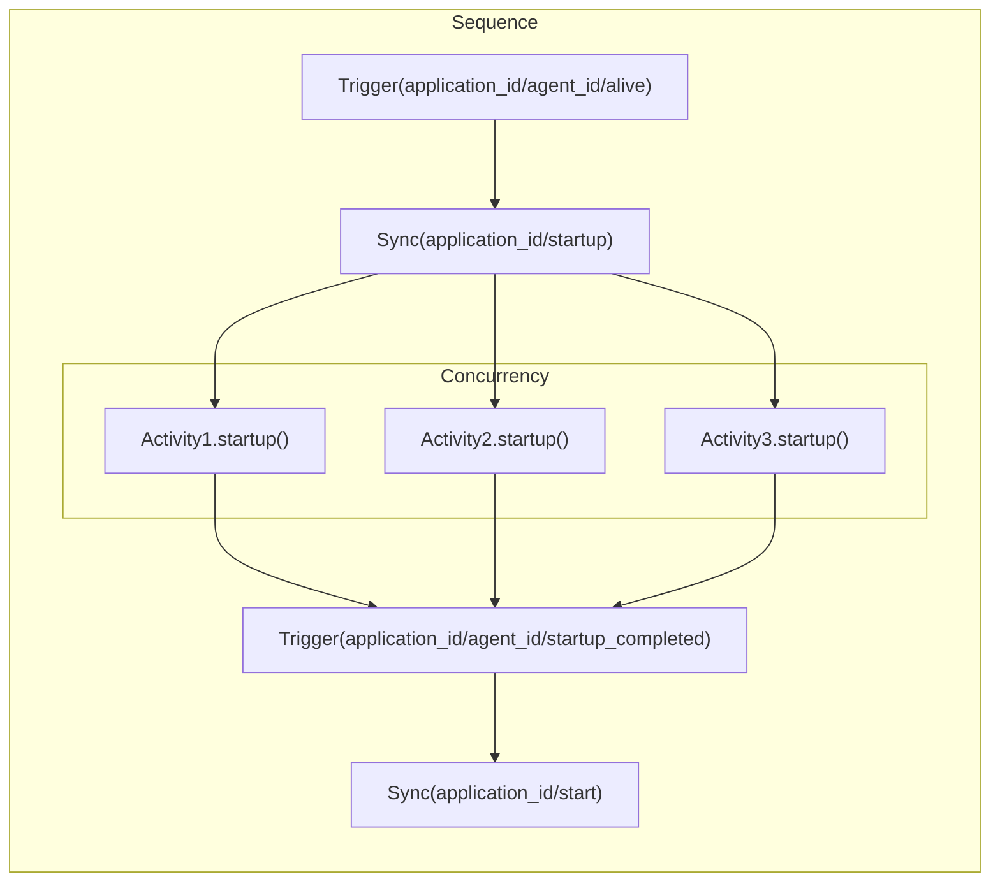
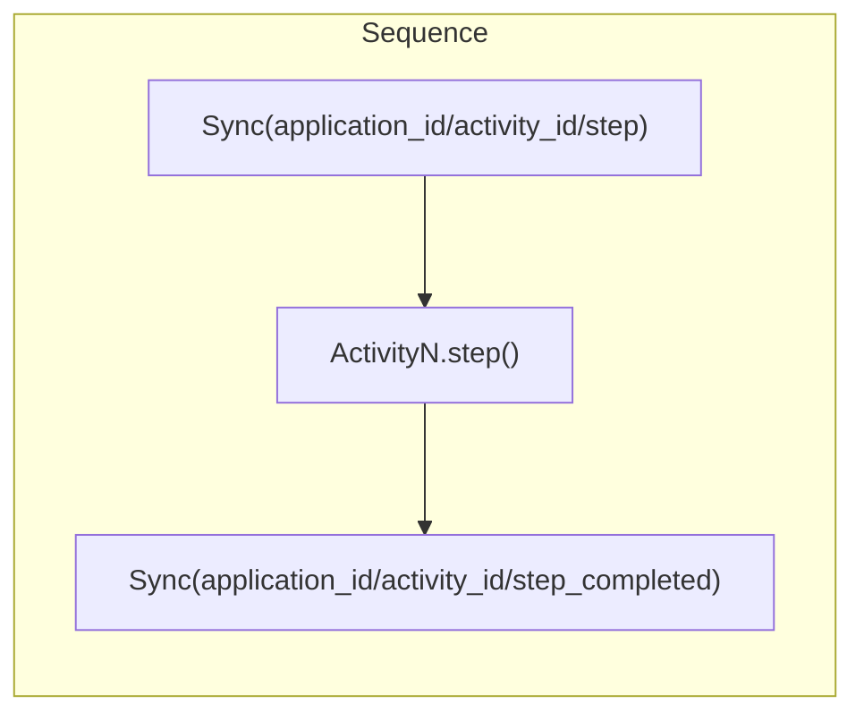
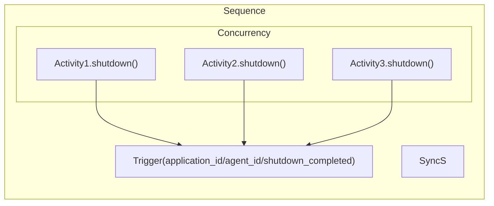
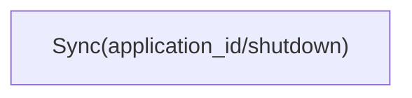
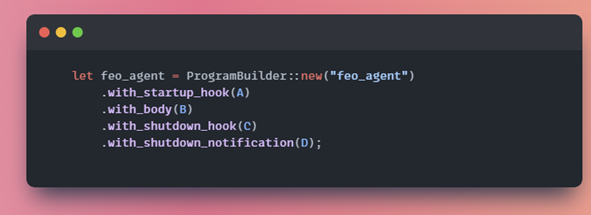
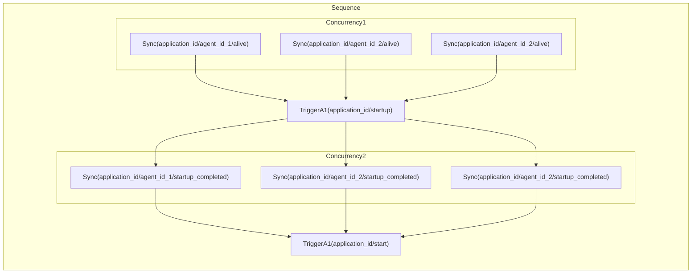
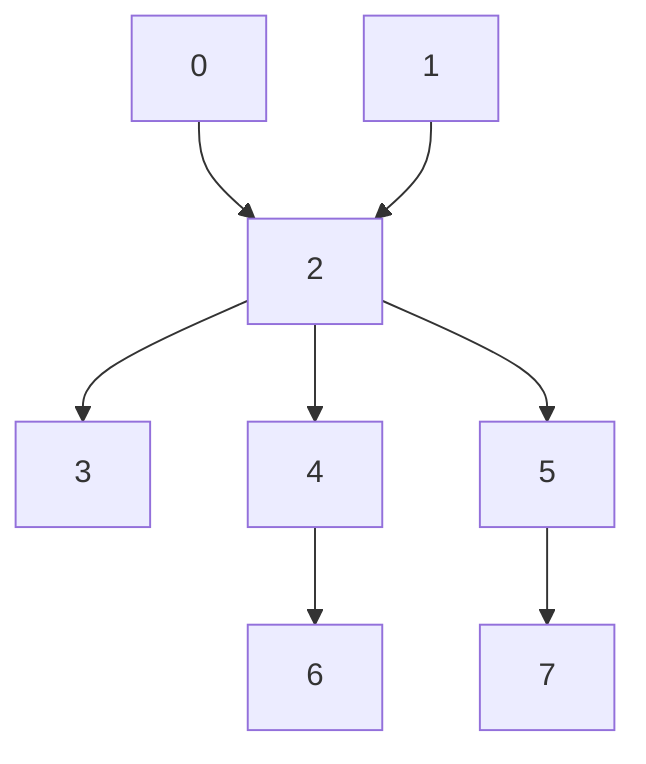
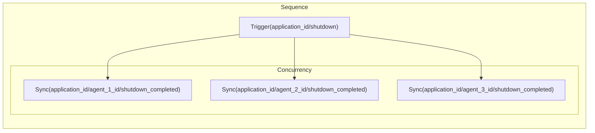
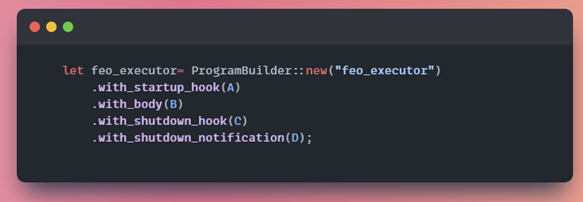

# Orchestration & FEO

## Static view

## FEO agents
FEO agents are responsible to wait on `Executor` commands and execute them. Below we describe how each part of FEO agent is transcoded by `Orchestration API`.

### Startup (A)
Each FEO agent on startup is suppose to:
- let primary process know it's alive
- wait for startup signal
- report started and enter into normal execution (waiting for orders)

This is encoded by using combination of `Sequence` and `Concurrency` `actions`:

### Step (B)
Each activity step function is encoded by simple `Sequence` of `actions`:

### Shutdown (C)

The shutdown functionality is encoded by simple `Sequence` and `Concurrency` `actions`:

### Shutdown request (D)
The agent shall all time wait for a request to shutdown, this is relized simply by registering hook:

### Overall FEO agent 
The overall FEO agent implemented by `Orchestration API` is a `Program` that is composed using above functionalities as below:

## FEO Executor
The executor is responsible for
- coordinate startup
- executing graph logic for activities
- coordinate shutdown
- ....

### Startup (A)
The startup coordination is build as below:

### Graph execution (B)
The graph of activities is translated currently with below schema:
- each activity is separate concurrent branch that can run as soon as all conditions are met
- each activity without dependency can run immediately in single cycle
- each activity with dependencies is translated into `Sequence` of `Sync` actions for corresponding "done" event before it can run
- each run execution is encoded as `Trigger` (start) & `Sync` (wait for finish) action

The above bolis down to translate below graph:

into 

```mermaid
graph TD;

    %% Activity 0
    TriggerA0E["Trigger(application_id/0/step)"];
    SyncA0EC["Sync(application_id/0/step_completed)"];


    TriggerA0E --> SyncA0EC;

    subgraph Sequence0
    direction TB
       TriggerA0E
       SyncA0EC
    end

    %% Activity 1
    TriggerA1E["Trigger(application_id/1/step)"];
    SyncA1EC["Sync(application_id/1/step_completed)"];


    TriggerA1E --> SyncA1EC;

    subgraph Sequence1
        direction TB
        TriggerA1E
        SyncA1EC
    end

  

    %% Activity 2

    SyncA2D1["Sync(application_id/0/step_completed)"];
    SyncA2D2["Sync(application_id/1/step_completed)"];

    TriggerA2E["Trigger(application_id/2/step)"];
    SyncA2EC["Sync(application_id/2/step_completed)"];

    SyncA2D1 --> SyncA2D2;
    SyncA2D2 --> TriggerA2E;
    TriggerA2E --> SyncA2EC;

    subgraph Sequence2
    direction TB
        SyncA2D1
        SyncA2D2
        TriggerA2E
        SyncA2EC
    end

     %% Activity 3

    SyncA3D1["Sync(application_id/2/step_completed)"];

    TriggerA3E["Trigger(application_id/3/step)"];
    SyncA3EC["Sync(application_id/3/step_completed)"];


    SyncA3D1 --> TriggerA3E;
    TriggerA3E --> SyncA3EC;

    subgraph Sequence3
    direction TB
        SyncA3D1
        TriggerA3E
        SyncA3EC
    end

 %% Activity 4

    SyncA4D1["Sync(application_id/2/step_completed)"];

    TriggerA4E["Trigger(application_id/4/step)"];
    SyncA4EC["Sync(application_id/4/step_completed)"];


    SyncA4D1 --> TriggerA4E;
    TriggerA4E --> SyncA4EC;

    subgraph Sequence4
    direction TB
        SyncA4D1
        TriggerA4E
        SyncA4EC
    end

     %% Activity 5

    SyncA5D1["Sync(application_id/2/step_completed)"];

    TriggerA5E["Trigger(application_id/5/step)"];
    SyncA5EC["Sync(application_id/5/step_completed)"];


    SyncA5D1 --> TriggerA5E;
    TriggerA5E --> SyncA5EC;

    subgraph Sequence5
    direction TB
        SyncA5D1
        TriggerA5E
        SyncA5EC
    end

     %% Activity 6

    SyncA6D1["Sync(application_id/4/step_completed)"];

    TriggerA6E["Trigger(application_id/6/step)"];
    SyncA6EC["Sync(application_id/6/step_completed)"];


    SyncA6D1 --> TriggerA6E;
    TriggerA6E --> SyncA6EC;

    subgraph Sequence6
    direction TB
        SyncA6D1
        TriggerA6E
        SyncA6EC
    end

     %% Activity 7

    SyncA7D1["Sync(application_id/5/step_completed)"];

    TriggerA7E["Trigger(application_id/7/step)"];
    SyncA7EC["Sync(application_id/7/step_completed)"];


    SyncA7D1 --> TriggerA7E;
    TriggerA7E --> SyncA7EC;

    subgraph Sequence7
    direction TB
        SyncA7D1
        TriggerA7E
        SyncA7EC
    end


    subgraph Concurrency
       Sequence0
       Sequence1
       Sequence2
       Sequence3
       Sequence4
       Sequence5
       Sequence6
       Sequence7
    end

```

### Shutdown (C)
The shutdown coordination is build as below:

### Shutdown request (D)

The primary process can connect any source to start shutdown routine. Currently this is not used in FEO as such signals is not defined.

### Overall FEO executor 
The overall FEO executor implemented by `Orchestration API` is a `Program` that is composed using above functionalities as below:

Additionally `ProgramBuilder` let us configure:
- cycle time
- overall error reaction
- ...